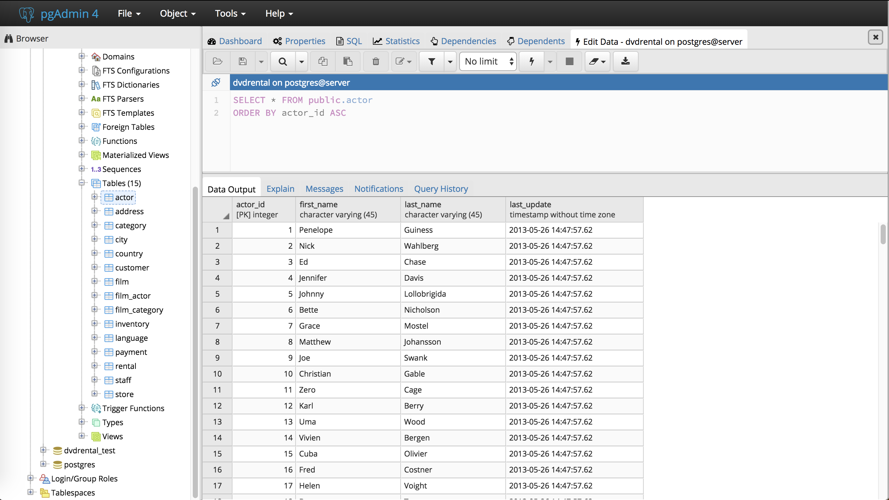
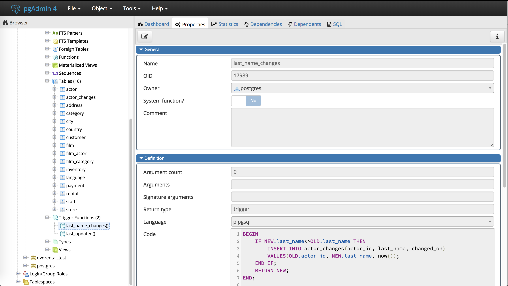
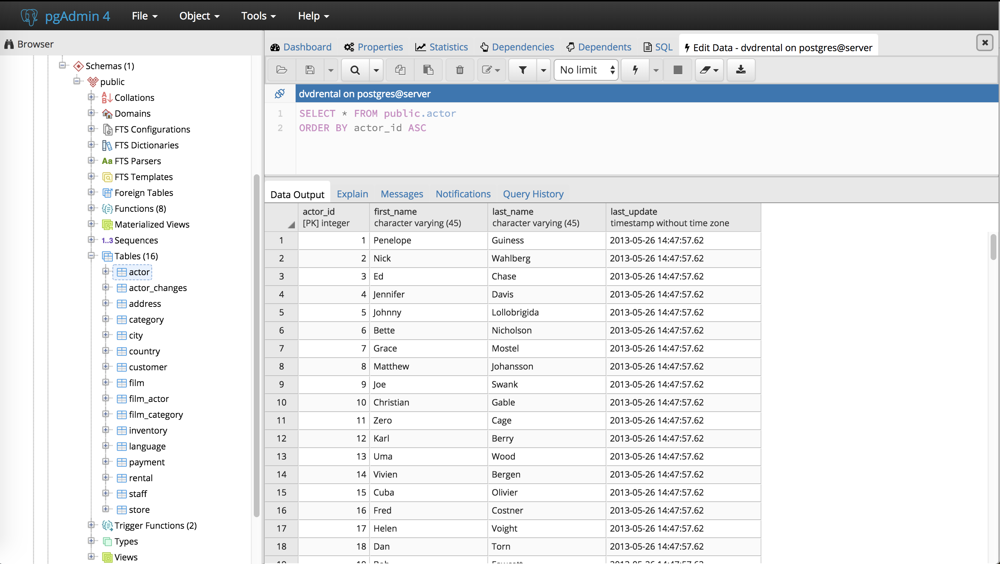

Triggers en PostgreSQL
================
Carlos Figueroa

En esta oportunidad aprenderemos a programar Triggers en PostgreSQL.
Supongamos el siguiente caso hipotético, que nos dará una idea de la
ventaja que le ofrece a un Data Scientist utilizar esta herramienta en
una base de datos.

### Situación:

Supongamos que existe una aplicación web con su propia base de datos
desarrollada por un tercero. Queremos desarrollar una herramienta de
Business Intelligence que nos permita conectarnos a esa base de datos,
pero desconocemos su estructura y apenas sabemos las variables (o
columnas) que necesitamos consultar para nuestra herramienta de BI.
Necesitamos tener entonces una base de datos propia con las variables de
interés, pero con la estructura que nosotros mismos definamos.

### Posibles soluciones:

Ante esto, podríamos tener varias soluciones, ordenadas de menor a mayor
eficiencia y dificultad de desarrollo:

1)  Generar una base de datos esclava, que sea una réplica idéntica a la
    original
    
    *Ventaja*: el usuario va a tener la data actualizada siempre.
    
    *Desventaja*: la velocidad de las consultas en la herrramienta de BI
    se ven afectadas negativamente. Principalmente por las consultas y
    joins que hay que hacer a la base de datos, que aún siendo la
    esclava, tiene la misma estructura original.

2)  Crear una base de datos que sirva como data warehouse, y programar
    un ETL que la actualice con cierta periodicidad
    
    *Ventaja*: Las consultas se ejecutan rápidamente, pues se puede
    estructurar el data darehouse de manera tal que sea una tabla por
    consulta. Puede hacerse en Python o R o cualquier lenguaje de tu
    comodidad.
    
    *Desventaja*: El data warehouse sólo está actualizado sólo cuando se
    ejecuta el ETL, cada cierto tiempo.

3)  Crear una base de datos que sirva como Data Warehouse, y programar
    triggers en ella que modifiquen las tablas de interés
    
    *Ventaja*:Las consultas se realizan rápidamente, pues se hacen una
    por tabla. Las tablas del data warehouse se actualizan
    automáticamente siempre que se modifique la base de datos original.
    
    *Desventaja*: Programar los triggers del data warehouse.

En este tutorial, nos enfocaremos en la solución 3, y programaremos un
trigger en una base de datos de ejemplo.

Creamos la siguente base de datos de ejemplo, en la que observamos la
tabla `actor`. Programaremos un trigger que hará que una nueva tabla que
crearemos, se modifique automáticamente siempre que exista una
modificación en la columna `last_name`.

<center>



</center>

Un trigger es una función ordinaria, solo que no toma ningún argumento y
retorna un tipo de valor `trigger` de esta manera:

``` sql
CREATE FUNCTION trigger_function() RETURN trigger AS
```

Es importante destacar que los triggers pueden definirse en cualquier
lenguaje soportado por PostgreSQL, pero a efectos de este tutorial,
usaremos PL/pgSQL como demostración.

### Definiendo un Trigger de ejemplo:

En este ejemplo, crearemos una nueva tabla llamada `actor_changes`, en
donde guardaremos los cambios realizados en el apellido `last_name` del
`actor`, cambiado en la fecha `changed_on`.

``` sql
CREATE TABLE actor_changes(
  actor_id integer PRIMARY KEY,
  last_name varchar(40) NOT NULL,
  changed_on timestamp without time zone
);
```

*Paso 1:* Vamos a crear una función llamada `last_name_changes()`:

``` sql
CREATE OR REPLACE FUNCTION last_name_changes()
  RETURNS trigger AS
$BODY$
BEGIN
    IF NEW.last_name<>OLD.last_name THEN
        INSERT INTO actor_changes(actor_id, last_name, changed_on)
        VALUES(OLD.actor_id, NEW.last_name, now());
    END IF;
    RETURN NEW;
END;
$BODY$
language plpgsql;
```

Esta función evalúa si la columna `last_name` de la tabla `actor`
cambió, y va a insertar en la tabla `last_name_changes` el id del
actor, el apellido que tenía antes del cambio y la fecha en la que se
realizó el cambio.

Podemos verificar que la función fue creada exitosamente:

<center>



</center>

*Paso 2:*

Vamos a enlazar esa función a la tabla `actor`. El trigger se llama
`last_name_changes`, y luego de que algún valor de la columna
`last_name` sea actualizado, la función trigger va a ser invocada,
insertando una nueva fila en la tabla `actor_changes`

``` sql
CREATE TRIGGER trigger_last_name_changes
  BEFORE UPDATE
  ON actor
  FOR EACH ROW
  EXECUTE PROCEDURE last_name_changes();
```

### Comprobando la funcionalidad:

Para confirmar, consultaremos la tabla original `actors`:

<center>



</center>

En la cual, vamos a modificar el apellido actor que posee el id 1, de la
siguiente manera:

``` sql
UPDATE actor SET last_name='Garcia' WHERE actor_id=1;
```

Para cambiar el apellido “Guiness”" a “Garcia”. Asi que nuestra tabla
original queda de la siguiente manera:

``` sql
SELECT * FROM public.actor
ORDER BY actor_id ASC
```

<div class="knitsql-table">

| actor\_id | first\_name | last\_name   | last\_update        |
| :-------- | :---------- | :----------- | :------------------ |
| 1         | Penelope    | Garcia       | 2018-09-26 15:41:51 |
| 2         | Nick        | Wahlberg     | 2013-05-26 14:47:57 |
| 3         | Ed          | Chase        | 2013-05-26 14:47:57 |
| 4         | Jennifer    | Davis        | 2013-05-26 14:47:57 |
| 5         | Johnny      | Lollobrigida | 2013-05-26 14:47:57 |
| 6         | Bette       | Nicholson    | 2013-05-26 14:47:57 |
| 7         | Grace       | Mostel       | 2013-05-26 14:47:57 |
| 8         | Matthew     | Johansson    | 2013-05-26 14:47:57 |
| 9         | Joe         | Swank        | 2013-05-26 14:47:57 |
| 10        | Christian   | Gable        | 2013-05-26 14:47:57 |

Displaying records 1 - 10

</div>

Y finalmente observamos que el trigger agregó una fila a la tabla
`actor_changes` automaticámente una fila con las características que
programamos:

``` sql
SELECT * FROM public.actor_changes
ORDER BY actor_id ASC
```

<div class="knitsql-table">

| actor\_id | last\_name | changed\_on         |
| --------: | :--------- | :------------------ |
|         1 | Garcia     | 2018-09-26 15:41:19 |

1 records

</div>
